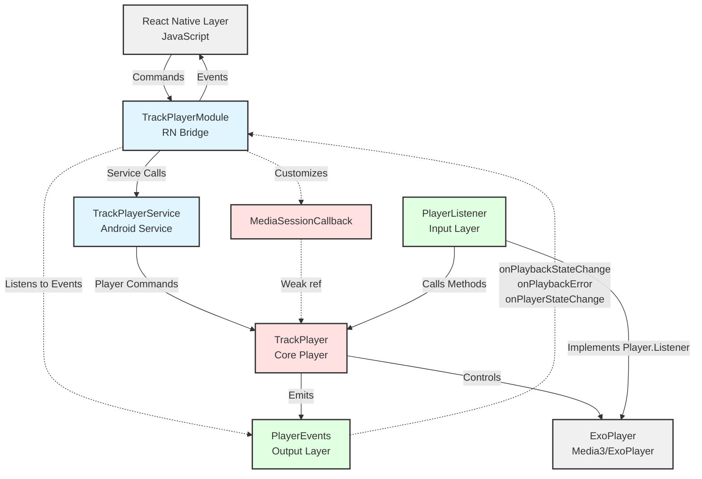

# Android Development Guide

## Quick Commands

- `yarn android` - Build and run on connected device/emulator
- `yarn android:format` - Format Kotlin code

## Architecture

## Project Structure

- **TrackPlayer.kt** - Core audio player (mirrors iOS TrackPlayer.swift)
- **TrackPlayerModule.kt** - React Native bridge (mirrors iOS TrackPlayerModule.swift)
- **TrackPlayerService.kt** - Android foreground service wrapper
- **TrackPlayerPackage.kt** - React Native package registration
- **event/** - Event types and enums
- **model/** - Data models (Track, etc.)
- **option/** - Configuration options and enums
- **player/** - PlayerListener (input layer) and PlayerEvents (output layer)
- **util/** - Utility classes
