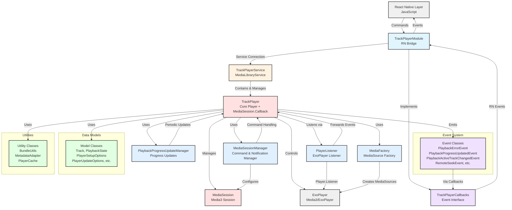

# Android Development Guide

## Quick Commands

- `yarn android` - Build and run on connected device/emulator
- `yarn android:format` - Format Kotlin code

## Architecture

## Project Structure

### Core Components
- **TrackPlayer.kt** - Core audio player with MediaSession.Callback implementation
- **TrackPlayerModule.kt** - React Native bridge implementing TrackPlayerCallbacks
- **TrackPlayerService.kt** - MediaLibraryService wrapper managing player lifecycle
- **TrackPlayerCallbacks.kt** - Event callback interface for RN communication
- **TrackPlayerPackage.kt** - React Native package registration

### Supporting Components
- **player/** - Core player logic and utilities
  - **PlayerListener.kt** - ExoPlayer event listener forwarding to TrackPlayer
  - **MediaFactory.kt** - MediaSource factory for different content types
  - **PlaybackProgressUpdateManager.kt** - Handles periodic progress updates
  - **PlayingState.kt** - Playing state enumeration

### Event System
- **event/** - Comprehensive event types for all player interactions
  - Playback events (PlaybackErrorEvent, PlaybackProgressUpdatedEvent, etc.)
  - Remote control events (RemoteSeekEvent, RemoteJumpForwardEvent, etc.)

### Data Models
- **model/** - Data structures and configuration
  - **Track.kt** - Track metadata and source information
  - **PlaybackState.kt**, **PlaybackMetadata.kt** - Player state representations
  - **PlayerSetupOptions.kt**, **PlayerUpdateOptions.kt** - Configuration objects
  - **AppKilledPlaybackBehavior.kt** - Background behavior settings

### Configuration & Options
- **option/** - Player configuration enumerations
  - **PlayerCapability.kt** - Available player capabilities
  - **PlayerRepeatMode.kt** - Repeat mode options
  - **AudioContentType.kt** - Audio content type classification
  - **CacheConfig.kt** - Caching configuration

### Utilities
- **util/** - Helper classes and utilities
  - **MediaSessionManager.kt** - MediaSession command and notification management
  - **MetadataAdapter.kt** - Metadata conversion utilities
  - **BundleUtils.kt** - Android Bundle manipulation helpers
  - **PlayerCache.kt** - Player state caching

### Extensions
- **extension/** - Kotlin extension functions
  - **EnumExtensions.kt** - Enum conversion utilities
  - **NumberExt.kt** - Numeric conversion helpers
