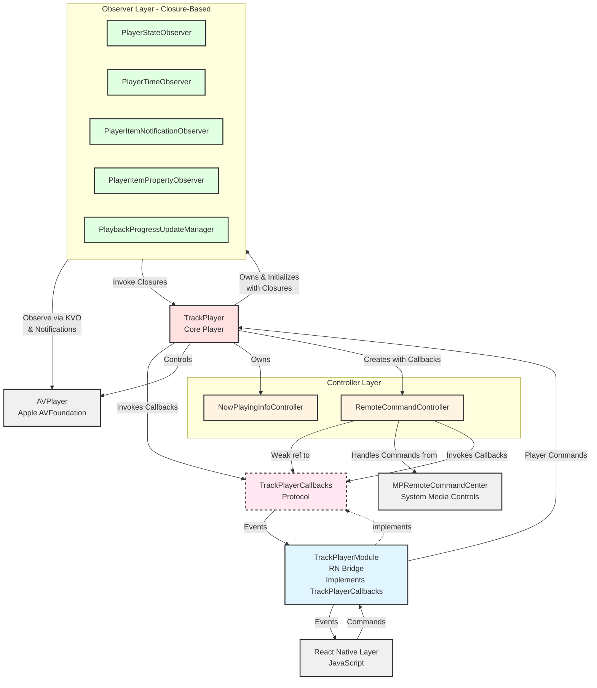

# iOS Development Guide

## Quick Commands

- `yarn ios:rebuild` - Rebuild and run with pod install (required after adding/removing files)
- `yarn ios:format` - Format Swift code

## Architecture

## Key Architecture Changes (Callback Refactor)

The iOS player now uses a **callback protocol pattern** instead of event emitters:

1. **TrackPlayerCallbacks Protocol** - Defines all event callbacks (playback state, progress, metadata, remote controls)
2. **TrackPlayerModule implements TrackPlayerCallbacks** - Bridges events to React Native
3. **RemoteCommandController** - Receives callbacks in init, invokes them for remote commands (no player dependency)
4. **Clean separation** - TrackPlayer invokes callbacks directly, no event system indirection

## Project Structure

- **TrackPlayer.swift** - Core audio player (mirrors Android's TrackPlayer.kt)
- **TrackPlayerModule.swift** - React Native bridge, implements TrackPlayerCallbacks (mirrors Android's TrackPlayerModule.kt)
- **TrackPlayerCallbacks.swift** - Protocol defining all event callbacks
- **Event/** - Event types and enums (for bridging to RN)
- **Option/** - Configuration options and enums
- **Model/** - Data models and error definitions
- **Observer/** - AVPlayer observation classes (input layer, use closures)
- **NowPlayingInfo/** - Media control center integration
- **RemoteCommand/** - Remote control handling (invokes callbacks)
- **Util/** - Utility classes
