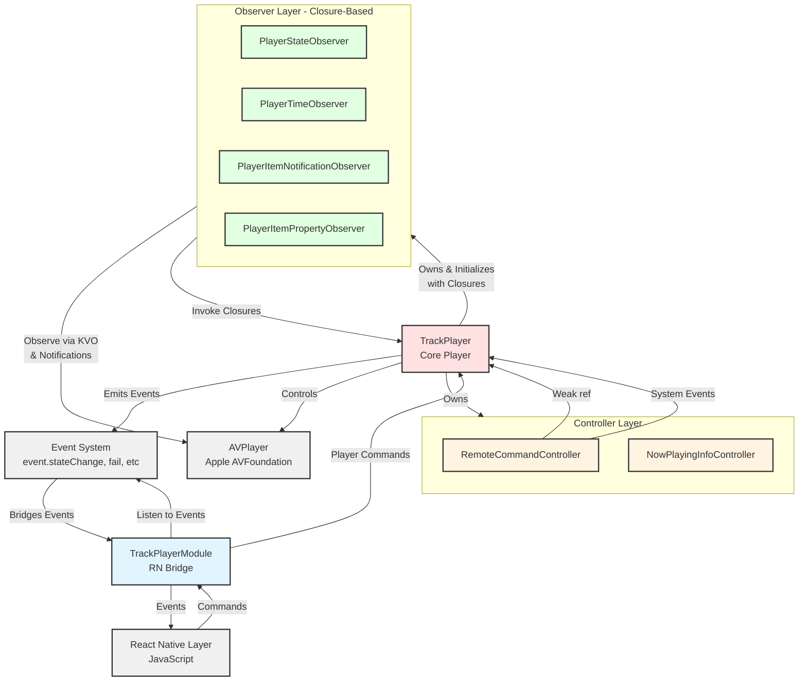

# iOS Development Guide

## Quick Commands

- `yarn ios:rebuild` - Rebuild and run with pod install (required after adding/removing files)
- `yarn ios:format` - Format Swift code

## Architecture

## Project Structure

- **TrackPlayer.swift** - Core audio player (mirrors Android's TrackPlayer.kt)
- **TrackPlayerModule.swift** - React Native bridge (mirrors Android's TrackPlayerModule.kt)
- **Event/** - Event types and enums
- **Option/** - Configuration options and enums
- **Model/** - Data models and error definitions
- **Player/** - Player event system
- **Observer/** - AVPlayer observation classes (input layer)
- **NowPlayingInfo/** - Media control center integration
- **RemoteCommand/** - Remote control handling
- **Util/** - Utility classes
